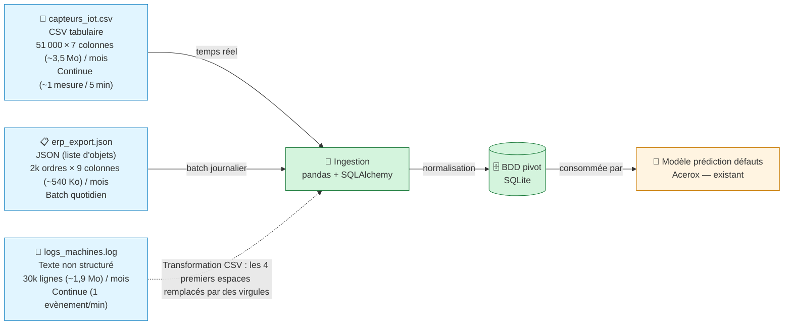

# Schéma des flux de données — Acerox Métallurgie

> Schéma Mermaid à compléter. Doit montrer :
> - **Sources** (capteurs IoT, ERP, logs, *bonus PDF*)
> - **Ingestion** (à concevoir en M3-B2)
> - **BDD pivot** (à modéliser en M3-B2)
> - **Modèle existant** Acerox (placeholder, hors-sujet ici)
>
> Légende explicite : qui produit, qui consomme, contraintes.

## Schéma

## Légende

> Reformule en 5 lignes max ce que le schéma raconte (qui produit quelle
> donnée, qui consomme, contraintes critiques).

- **Producteur** : Capteurs IoT (temps réel), ERP (batch quotidien), logs machines (texte non structuré)
- **Consommateur final** : Modèle prédictif Acerox (consomme la BDD normalisée)
- **Contraintes critiques** (fréquence / RGPD / qualité) : Fréquence élevée (1 mesure/5 min à 1 événement/min), qualité des données (transformation des logs), potentiel RGPD sur les logs machines

## Décisions associées

- Source(s) retenues en priorité : `capteurs_iot.csv`
- Source(s) écartées : aucune
- Source bonus (PDF) traitée ? oui / non, pourquoi : ?

---

*Schéma produit par Romain, 30/06/2026, dans le cadre du brief M3-B1 ATOS.*
